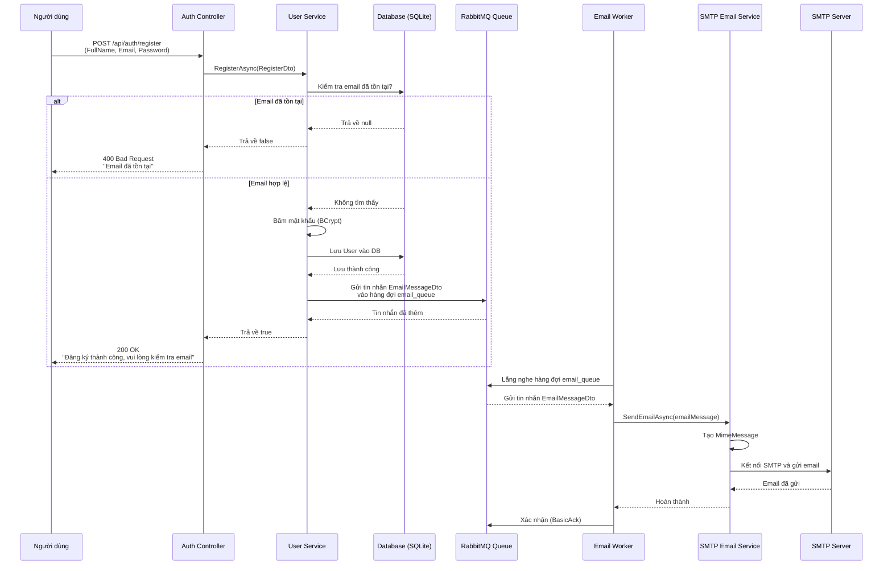
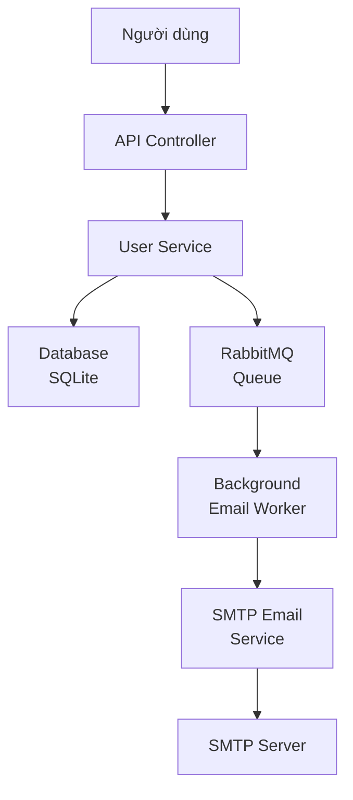

# Luồng Đăng Ký Người Dùng

## Biểu đồ luồng hoạt động

## Biểu đồ hệ thống

## Mô tả chi tiết các bước

### 1. Người dùng gửi yêu cầu đăng ký
- Gửi request POST đến `/api/auth/register`
- Body chứa: FullName, Email, Password

### 2. Controller xử lý yêu cầu
- `AuthController` nhận request và gọi `UserService.RegisterAsync()`

### 3. Kiểm tra và lưu vào database
- `UserService` kiểm tra xem email đã tồn tại trong DB chưa
- Nếu tồn tại: trả về lỗi
- Nếu chưa: băm mật khẩu bằng BCrypt và lưu User vào DB

### 4. Đưa email vào hàng đợi RabbitMQ
- `UserService` tạo `EmailMessageDto` với thông tin email chào mừng
- `RabbitMQService` gửi tin nhắn vào hàng đợi `email_queue`
- Tin nhắn được đánh dấu persistent để đảm bảo không mất dữ liệu

### 5. Background Worker xử lý hàng đợi
- `EmailWorker` chạy nền, lắng nghe hàng đợi `email_queue`
- Khi có tin nhắn mới, worker lấy tin nhắn ra và xử lý
- Worker tạo scope để lấy `EmailService` và gửi email

### 6. Gửi email qua SMTP
- `SmtpEmailService` sử dụng MailKit để kết nối SMTP server
- Tạo email HTML với nội dung chào mừng
- Gửi email đến địa chỉ người dùng
- Xác nhận gửi thành công và trả về worker

### 7. Hoàn thành
- Worker gửi `BasicAck` cho RabbitMQ để xóa tin nhắn khỏi hàng đợi
- Người dùng nhận được email chào mừng
